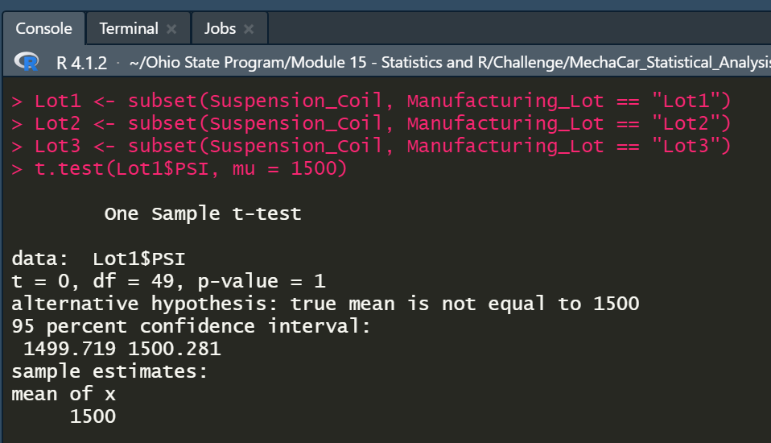

# :red_car: MechaCar_Statistical_Analysis

OSU Challenge 15 - R

## Linear Regression to Predict MPG, and write a short summary using a screenshot of the output from the linear regression, and address the following questions:

```r
lm(mpg ~ vehicle_length + vehicle_weight + spoiler_angle + ground_clearance + AWD,
  data = MechaCar)  #generate multiple linear regression model
summary(lm(mpg ~ vehicle_length + vehicle_weight + spoiler_angle + ground_clearance +
  AWD, data = MechaCar))  #generate summary statistics
```

Which variables/coefficients provided a non-random amount of variance to the mpg values in the dataset?
- vehicle_length and ground_clearance show the greatest correlation vis-à-vis mpg.
Is the slope of the linear model considered to be zero? Why or why not?
- AWD has a negative correlation, vehicle_length and ground_clearance have a positive correlation, and the other two have a negligible (almost zero) slope.

|Data Point | Slope |
|-----------|-------|
|vehicle_length   | 6.267e+00  |
|vehicle_weight   | 1.245e-03  |
|spoiler_angle    | 6.877e-02  |
|ground_clearance | 3.546e+00  |
|AWD              | -3.411e+00 |


Does this linear model predict mpg of MechaCar prototypes effectively? Why or why not?
- Only two of the five factors contribute significantly in determining mpg - vehicle_length and ground_clearance.


A better use of the AWD column would be to use it as another category to investigate.


With linear regression line.


## Summary Statistics on Suspension Coils, and write a short summary using screenshots from your total_summary and lot_summary dataframes, and address the following question:

```r
total_summary <- Suspension_Coil %>%
  summarize(Mean = mean(PSI), Median = median(PSI), Variance = var(PSI), SD = sd(PSI))  #create summary table.
total_summary
View(total_summary)

lot_summary <- Suspension_Coil %>%
  group_by(Manufacturing_Lot) %>%
  summarize(Mean = mean(PSI), Median = median(PSI), Variance = var(PSI), SD = sd(PSI),
    .groups = "keep")  #create summary table grouped by lot.
View(lot_summary)
```


The design specifications for the MechaCar suspension coils dictate that the variance of the suspension coils must not exceed 100 pounds per square inch. Does the current manufacturing data meet this design specification for all manufacturing lots in total and each lot individually? Why or why not?
- The total_summary has a variance of less than 100 pounds per square inch (
62.29356)
- The individual lot summaries produce different results: Lot1 and Lot2 are within tolerance, but the variance for Lot3 is 170.2861224 and exceeds the pre-determined cutoff of 100.

## T-Tests on Suspension Coils

```r
# Deliverable 3: T-Tests on Suspension Coils
t.test(Suspension_Coil$PSI, mu = 1500)

Lot1 <- subset(Suspension_Coil, Manufacturing_Lot == "Lot1")
Lot2 <- subset(Suspension_Coil, Manufacturing_Lot == "Lot2")
Lot3 <- subset(Suspension_Coil, Manufacturing_Lot == "Lot3")
t.test(Lot1$PSI, mu = 1500)
t.test(Lot2$PSI, mu = 1500)
t.test(Lot3$PSI, mu = 1500)
```

T-Test results for all lots combined.
- Overall the population meets the standard for variance < 100 psi


T-Test results for individual lots.
- Lots 1 and 2 meet the standard for variance.




- Lot3 has a p-value of less than 0.05 (p-value = 0.04168), therefore is an unacceptable representation of the whole population.


## Study Design: MechaCar vs Competition

If MechaCar would like to compare itself to the competition, more statistical analysis should be done.
- Given the climate crisis and current geopolitical instability, MechCar should focus on fuel efficiency.
- A theoretical null hypothesis could be: MechaCar's fleet of cars avg mpg is equal to the competition's mean across all subgroups.
- MechaCar should conduct a t-test() on all manufacturer's mpg numbers to assess where it stands in the industry.  Subset() could be used to drill down and compare different body styles.
- MechaCar would need to be able to access the competitions models and mpg ratings in order to conduct this research.
